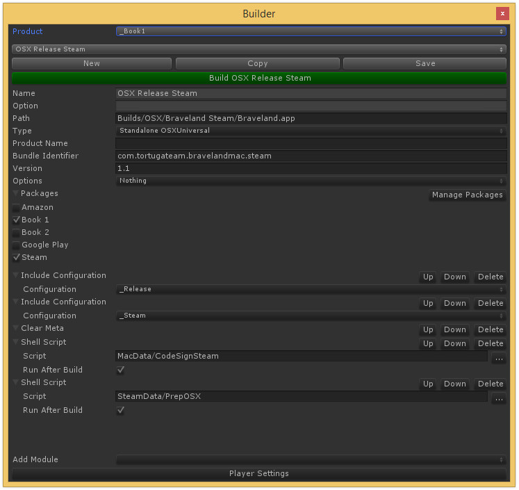

Build Tools for Unity 3D
===========================

**Unity 4.5+ is required**
<br>
**Unity Pro is required**

A tool for easy automating and customizing Unity 3D build process. This tool is used in development of [Braveland](http://www.tortugateam.com)



It uses standard BuildPipeline.Build, stores configuration in readable and editable JSON files, provides GUI for managing configurations and modularity for customizing build process.

**Core features**
- Support for mutltiple configurations, stored in separate external JSON files - easy to read & modify.
- Combine assets into packages and exclude/include packages from build configurations.
- Easy modularity, because every project's build pipeline is unique.
- Can be launched programmatically (for the ones who want to make unattended builds).
- Supports OBB manipulation for Android builds
- Nested and switchable configurations

How To Start
------------
Just copy the contents *Assets/Standard Assets/Editor* folder to your project. Then click *Window -> PPTools -> Builder* in the main menu.

Writing Custom Build Modules
----------------------------

To make a custom build module you need to create a class, derived from CustomBuildModule. The GUI automatically scans all available modules and provides means to use them in your configuration.

The module class can be decorated with *Description* and *Browsable* attributes to set custom title or hide module from GUI.
It's not required but highly recommended to decorate class with *Guid* attribute, to preserve the integrity of configuration files after refactoring.

```csharp
using System;
using System.ComponentModel;
using System.Runtime.InteropServices;
using UnityEditor;

namespace PPTech.Builder.Modules
{
	[Description("Build Scenes")]
	[Guid("33AD24D3-6437-4925-B2E9-4307AAFAB983")]
	public class BuildScenes : BuilderModule
	{
		public override void OnBeforeBuild(BuilderState config)
		{
			var scenes = EditorBuildSettings.scenes;
			if (scenes == null)
			{
				return;
			}
			foreach (var s in scenes)
			{
				if (s.enabled && !config.scenes.Contains(s.path))
				{
					config.scenes.Add(s.path);
				}
			}
		}
	}
}
```

Builder module events are fired in the same order the modules are arranged in configuration if not stated otherwise.

- **OnBeforeBuild** - is fired first after the main configuration is set but before the build.
- **OnBuild** - is fired before the build but after all *OnBeforeBuild* are called. It can be used to check the options set by other modules in *OnBeforeBuild*.
- **OnAfterBuild** - is fired after the build is done. Is not fired when the build fails. For Android builds this is run after OBB file is unpacked for processing.
- **OnFinishBuild** - is fired after the build is done. Is not fired when the build fails. For Android builds this is run after OBB file is repacked back.
- **OnCleanupBuild** - is fired after the build is done and after all *OnAfterBuild* calls. Is fired even when the build fails. Fired in reverse order.

The following methods are not build events but still can be overriden to suit your needs.

- **FromJson** - is used to load module settings from stored data.
- **ToJson** - is used to store module settings to JSON file.

- **OnGUI** - is used to draw GUI for module settings in the builder window.

Packages
--------

Packages is a way to organize your assets to be left untouched or excluded from the build.
Packages contain references to assets. Every asset that is referenced by the package is to be excluded from any build unless the package is included in the build configuration.
The assets are excluded from the build by moving them inside "Editor/_ExcludedAssets/" and recovering them after the build is complete. The excluded assets list is stored to recover assets in case something goes wrong.

Some asset can provide additional references to assets so they can also be excluded. This is handled by defining a custom BuilderPackageAssetExpander.
An implementation of BuilderPackageAssetExpander should be marked with *BuilderPackageAssetExpanderFor* attribute to denote the type of asset, that should be "expanded".
**FillGuids** method should be implemented to provide additional assets' guids that are associated with the package.

```csharp
using System.IO;
using UnityEditor;
using UnityEngine;

namespace PPTech.Builder.Tools
{
	[BuilderPackageAssetExpanderFor(typeof(PPSpriteAtlas))]
	public class PPSpriteAtlasExpander : BuilderPackageAssetExpander
	{
		public override void FillGuids(Object obj, System.Collections.Generic.ICollection<string> target)
		{
			var atlas = (PPSpriteAtlas)obj;

			string path = null;
			if (atlas.isStreamingAsset)
			{
				path = PPSpriteAtlas.StreamingAtlasesDir + atlas.name + ".png";
			}
			else
			{
				var asset = Resources.Load(PPSpriteAtlas.AtlasesResourceDir + atlas.name, typeof(Texture));
				if (asset != null)
				{
					path = AssetDatabase.GetAssetPath(asset);
				}				
			}
			if (path == null || !File.Exists(path))
			{
				return;
			}

			target.Add(AssetDatabase.AssetPathToGUID(path));
		}	
	}
}
```

Nested configurations and configuration options
-----------------------------------------------

Build configurations can be nested using "Include Configuration" build module. 
The "included" configuration is executed following the same order rules defined for all the modules.

Build configuration can be marked as Option. To do this you need to fill an Option field in. This field defines option group which this configuration is contained in.
If at least one option group is defined, the selection control will appear which allows you to set the current option for the build.
The "option" configuration can be executed via "Include Option" build module which behaves like "Include Configuration", but the included configuration depends on the option selected for the group.


External libraries and license
-----------------------

This code uses following third-party libraries:
- **Rotorz Reorderable List**, https://bitbucket.org/dipyalov/reorderable-list-editor-field-for-unity. The original source code is located at https://bitbucket.org/rotorz/reorderable-list-editor-field-for-unity
- **Newtonsoft Json.NET**, http://james.newtonking.com/json
- **SharpZipLib**, http://icsharpcode.github.io/SharpZipLib/

This code is licensed under [MIT license](LICENSE)
